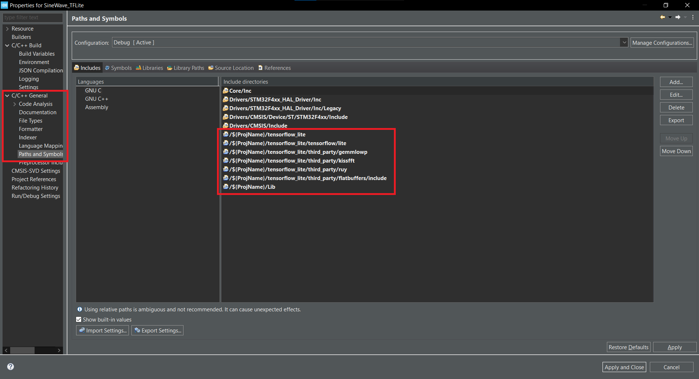
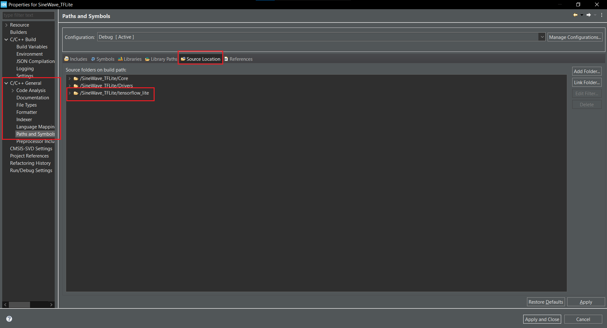
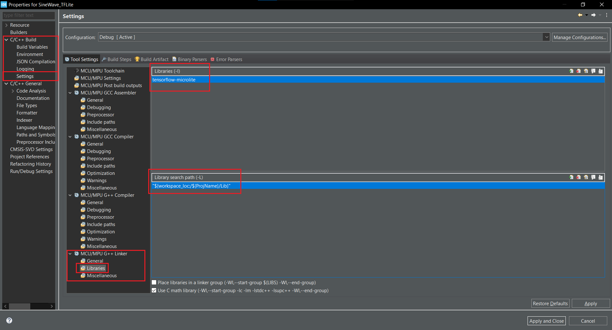
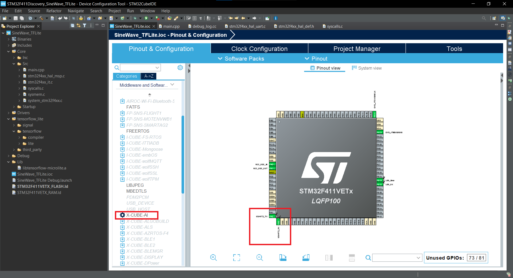
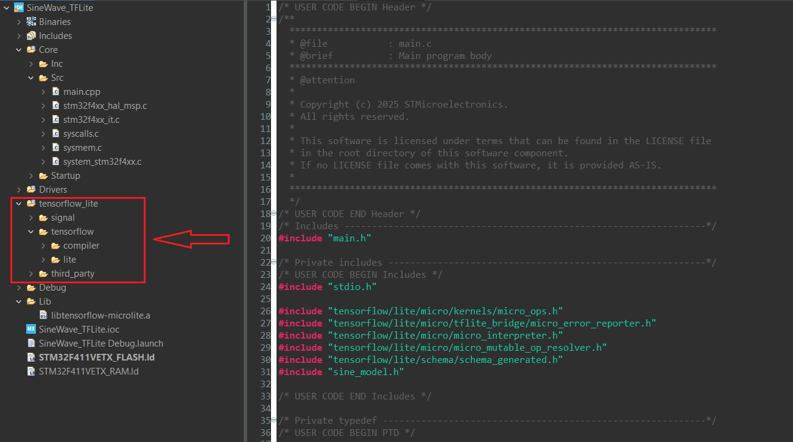
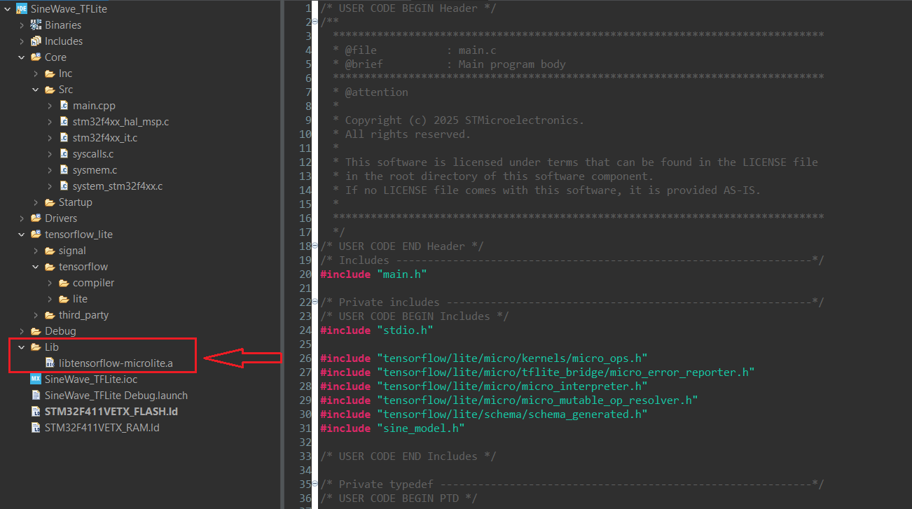

# How to Install
## Acknowledgments
Special thanks to **DevHeads** for their [tutorial video](https://www.youtube.com/watch?v=6XJ4M31ZvH0&list=PL2mKSkagAaJjjnVujAPwVsZobEfADTAxN&index=3)  
and **Shawn Hymel** for his [video](https://www.youtube.com/watch?v=gDFWCxrJruQ&t=742s).

## The way I took:
I used a Linux system for building TensorFlow Lite Micro, and I recommend you do the same:

1. Clone the repository:
   ```bash
   git clone https://github.com/tensorflow/tflite-micro.git

2. cd tflite-micro
3. ```bash
   make -f tensorflow/lite/micro/tools/make/Makefile TARGET=cortex_m_generic TARGET_ARCH=cortex-m4 microlite
For more details, [check the](https://github.com/tensorflow/tflite-micro/blob/main/tensorflow/lite/micro/cortex_m_generic/README.md) 

4. After building, you will get a file named **libtensorflow-microlite.a**.
**NOTE:**If you are working on Windows, copy this file over to your Windows environment.

5. add libtensorflow-microlite.a under Properties → C/C++ Build → Settings → MCU GCC Linker → Libraries in the STM32CubeIDE **(See the images below for detailed steps.)**

6. back to linux: Run the project generation script to create a standalone TFLM tree:  
   ```bash
   python3 tensorflow/lite/micro/tools/project_generation/create_tflm_tree.py <desired_path> **for example**```bash
   python3 tensorflow/lite/micro/tools/project_generation/create_tflm_tree.py ~/Mytflm/tflm-tree
For more details, [check the](https://github.com/tensorflow/tflite-micro/blob/main/tensorflow/lite/micro/docs/new_platform_support.md)

7. A new folder with your chosen name will be created (e.g., Mytflm).This folder contains signal, tensorflow, and third_party.
**NOTE_1:**If you are working on Windows, you will also need to transfer this folder to your Windows environment.
**NOTE_2:**During compilation, your project may throw an error related to `array.h`. To fix this, copy the `array.h` file from the **tflite-micro** repository into your **tflm-tree** folder.

8. You don't need to use X-Cube-AI.
9. Good Luck

## Output Example







